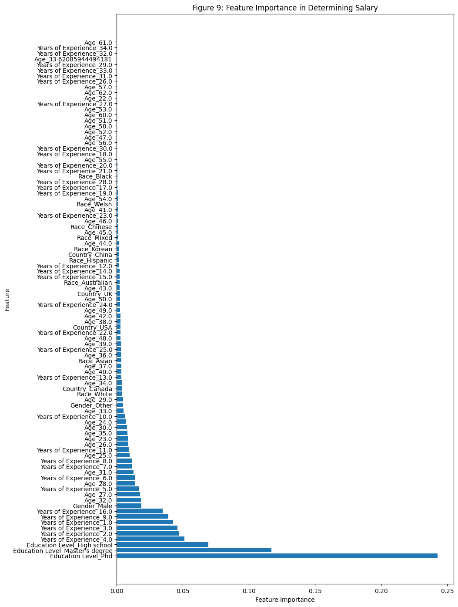
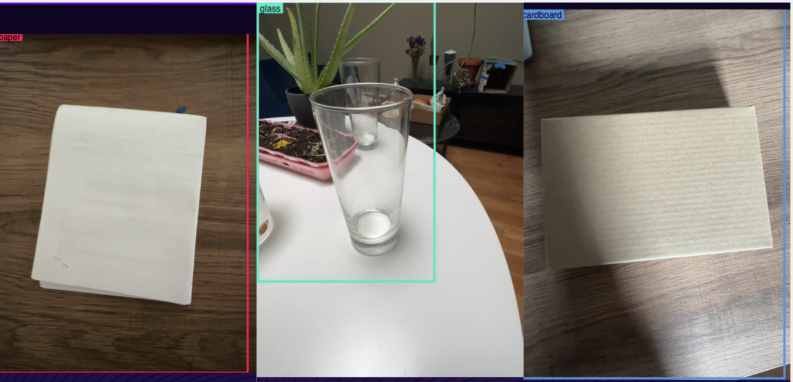

## Portfolio

---

### Github Projects

[Salary Predictions](https://github.com/frangi2002/salary_prediction/blob/main/Salary.ipynb) 
*Welcome to the Salary analysis exploration. Throughout this notebook I have used DecisionTreeRegression() to try to predict salaries based on certain variables (Gender, Race, Schooling, Country of origin, Years of Experience, Education Level, and Age).*

---
[Sudoku Game](https://github.com/frangi2002/Sudoky_Project)
*This repository contains a powerful and efficient Sudoku solver implemented in Python. The solver is capable of solving any 9x9 Sudoku puzzle, leveraging a recursive algorithm that explores possible solutions until it finds the correct one.*

---
[Image Recognition](https://github.com/frangi2002/YOLOv7-eleven58)
*Welcome to the Trash Can Project repository, where we leverage the cutting-edge YOLOv7 image recognition model with a custom dataset to identify whether objects are recyclable or not. Our innovative startup idea aims to revolutionize waste management by empowering businesses and communities to create customizable solutions for efficient recycling* \n 
<a href="https://www.eleven58.tech/">Visit eleven58's website</a>

---

### Certificates

- [Google Data Analytics Professional Certificate](https://coursera.org/share/8df420be487bd770b504246909a4db2a)
- [Bloomberg Market Concepts (BMC)](https://portal.bloombergforeducation.com/certificates/T3iyLkvYXnwrbuJgLx11JuVk)
- [Foundations: Data, Data, Everywhere](https://coursera.org/share/2e72dab851b91555c09876ddbf0cefb2)
- [Project 4 Title](http://example.com/)
- [Project 5 Title](http://example.com/)

---

---

Page template forked from <a href="https://github.com/evanca/quick-portfolio">evanca</a>

<!-- Remove above link if you don't want to attibute -->
